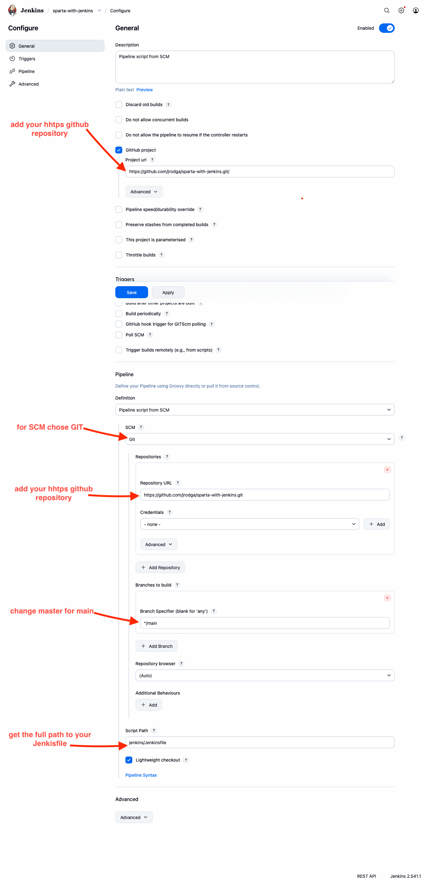
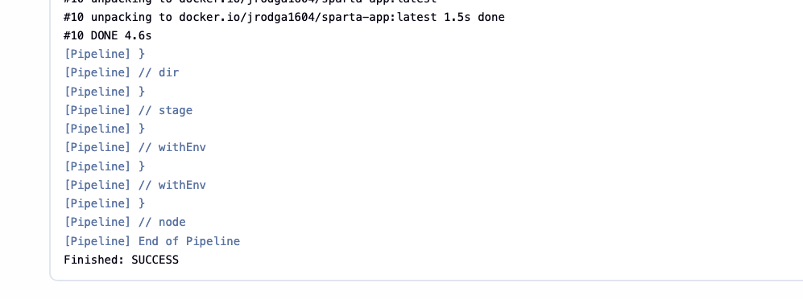
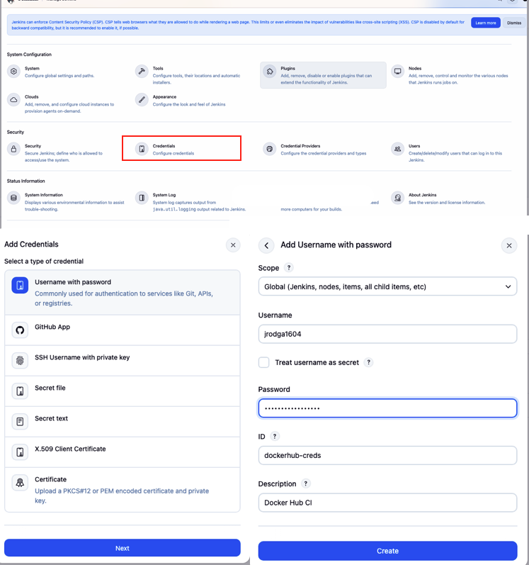

# Phase 1 — Setting Up Jenkins Locally (Docker)
## Objective

The goal of this phase is to:

- Run Jenkins locally using Docker

- Connect Jenkins to this GitHub repository

- Execute a simple pipeline

- Confirm Jenkins can run Docker commands

This ensures our CI system is correctly configured before moving to AWS deployment.

##
### Architecture (Phase 1)

```nginx
Developer → GitHub → Jenkins (Docker on local machine)
```
At this stage:

- Jenkins runs inside a Docker container

- Jenkins reads the `Jenkinsfile` from this repository

- Jenkins executes pipeline steps locally

No AWS or deployment is involved yet.
##
### Step 1 — Run Jenkins in Docker

Create a persistent volume:
```bash
docker volume create jenkins_home
```

### What is a Docker volume?

A Docker volume is:

    Persistent storage managed by Docker.

Normally, when you stop and delete a container, all its data is lost.

But Jenkins stores:

- Installed plugins

- Job configurations

- Credentials

- Build history

- Pipeline settings

If we didn’t use a volume:

- Every time Jenkins restarts, it would reset.

- We would lose everything.

Run jenkins:
```bash
docker run -d --name jenkins -p 8080:8080 -p 50000:50000 -u root -v jenkins_home:/var/jenkins_home -v /var/run/docker.sock:/var/run/docker.sock jenkins/jenkins:lts
```
**really long let me breakdown for you :**

```bash
docker run -d \
  --name jenkins \
  -p 8080:8080 \
  -p 50000:50000 \
  -u root \
  -v jenkins_home:/var/jenkins_home \
  -v /var/run/docker.sock:/var/run/docker.sock \
  my-jenkins-docker

```
**What `-u` root does**

This flag runs the Jenkins container as the root user.

Root has permission to access:
```arduino
/var/run/docker.sock
```
This allows Jenkins to execute:

- docker build

- docker run

- docker push

- docker compose

### Why This Is Not Suitable for Production

Running CI/CD systems as root is not recommended in production environments because:

- It bypasses Linux security controls

- It increases the attack surface

- If Jenkins is compromised, the attacker gains root-level access to Docker

- Docker socket access effectively grants host-level control

In enterprise environments, this would be considered a security risk.

`-p 8080:8080`

This means:

- Host machine port 8080

- Connects to container port 8080

so when you open:

```arduino
http://localhost:8080
```

you are accesing:

```scss
Jenkins running inside the container
```


`-p 50000:50000`

This port is used by:

- Jenkins agents (distributed builds)

- Future scaling if needed

For now, it’s not heavily used, but it’s best practice to expose it.
##
`-v jenkins_home:/var/jenkins_home`

This provides:

    Persistent storage for Jenkins data.

Without it:

- Restart = data loss

- Reinstall plugins every time

- Recreate jobs every time

This is critical.
##
`-v /var/run/docker.sock:/var/run/docker.sock`

This one is extremely important.

What is `/var/run/docker.sock`?

It is:

    The communication socket between Docker CLI and Docker daemon.

By mounting it into the Jenkins container:

We allow Jenkins to:

- Build Docker images

- Run containers

- Push to Docker Hub

- Use Docker Compose

Without this mount:
```bash
docker build ...
```

it wil fail with:

```pgsql
Cannot connect to Docker daemon
```

## Visual Explanation

```arduino
Your Laptop
│
├── Docker Engine
│     ├── Jenkins Container
│     │      ├── Jenkins UI
│     │      └── Can run docker commands
│     │
│     └── Docker Volume: jenkins_home
│
└── Browser → localhost:8080 → Jenkins
```
##
### Summary Table
| Flag                                           | Purpose                         | Why Needed                |
| ---------------------------------------------- | ------------------------------- | ------------------------- |
| `-p 8080:8080`                                 | Exposes Jenkins UI              | Access via browser        |
| `-p 50000:50000`                               | Jenkins agent communication     | Future scalability        |
| `-v jenkins_home:/var/jenkins_home`            | Persistent data storage         | Prevent data loss         |
| `-v /var/run/docker.sock:/var/run/docker.sock` | Allow Jenkins to control Docker | Build & deploy containers |


configuration for your first job to chek it work:
- select new job
- type: pipeline 


# PHASE 2 — Build Sparta App Docker Image with Jenkins (Clean Start)

### STEP 1 — Confirm Project Structure

Your repository should look like this:

```csharp
sparta-with-jenkins/
│
├── app/
│   ├── Dockerfile
│   ├── package.json
│   ├── app.js
│   ├── seeds/
│   ├── models/
│   └── ...
│
└── jenkins/
    └── Jenkinsfile
```
Important:

- `Dockerfile` must be inside `app/`

- It must be named exactly: `Dockerfile` (capital D)

- No extension
##
### STEP 2 —  Dockerfile 

So your app/Dockerfile must be:

```dockerfile
FROM node:20-alpine

WORKDIR /usr/src/app

# Copy everything first (so seeds exist)
COPY . .

# Then install dependencies
RUN npm install

EXPOSE 3000

CMD ["node", "app.js"]
```
commit the changes:
```bash
git add .
git commit -m " Dockerfile build order"
git push
```
##
### STEP3 - Clean Jenkinsfile
Replace your `jenkins/Jenkinsfile` with this minimal clean version:
```groovy
pipeline {
  agent any

  environment {
    IMAGE_NAME = "jrodga1604/sparta-app"
  }

  stages {

    stage('Checkout') {
      steps {
        checkout scm
      }
    }

    stage('Build Docker Image') {
      steps {
        dir('app') {
          sh 'docker build -t $IMAGE_NAME:latest .'
        }
      }
    }

  }
}
```

once again commit and push

```bash
git add .
git commit -m "Phase 2 clean build pipeline"
git push
```
##
### STEP 5 — Run Pipeline

Click:

Build Now

Watch console.

You should see:
```bash
Step 1/...
Successfully built ...
Successfully tagged jrodga1604/sparta-app:latest
```


##
### STEP 6 — Verify on Host

Run on your machine:
```bash
docker images
```


# PHASE 3 — Push Docker Image to Docker Hub

### Objective

After this phase:

- Every push to main

- Jenkins builds your image

- Jenkins logs in to Docker Hub securely

- Jenkins pushes the image

- Image becomes available globally

Architecture now becomes:

```markdown
Developer → GitHub → Jenkins
                          ↓
                   docker build
                          ↓
                    docker push
                          ↓
                     Docker Hub
```
##
### STEP 1 — Create Docker Hub Access Token

Go to Docker Hub:

Account Settings → Security → Access Tokens → New Token

Create:
```mathematica
Name: jenkins-ci
Permissions: Read & Write
```

**Copy the token.**
##
### STEP 2 — Add Docker Hub Credentials in Jenkins

Go to:

Manage Jenkins → Credentials → Global → Add Credentials

Choose:

- Kind: Username with password

- Username: your Docker Hub username (e.g. jrodga1604)

- Password: paste Docker Hub token

- ID: dockerhub-creds

- Description: Docker Hub CI

**Save.**

##
### STEP 3 — Update Jenkinsfile

Replace your current Jenkinsfile with this:

```groovy
pipeline {
  agent any

  environment {
    IMAGE_NAME = "jrodga1604/sparta-app"
    DOCKER_CREDS = "dockerhub-creds"
  }

  stages {

    stage('Checkout') {
      steps {
        checkout scm
      }
    }

    stage('Build Docker Image') {
      steps {
        dir('app') {
          sh """
            docker build -t $IMAGE_NAME:$BUILD_NUMBER .
            docker tag $IMAGE_NAME:$BUILD_NUMBER $IMAGE_NAME:latest
          """
        }
      }
    }

    stage('Login to Docker Hub') {
      steps {
        withCredentials([usernamePassword(
          credentialsId: DOCKER_CREDS,
          usernameVariable: 'DOCKER_USER',
          passwordVariable: 'DOCKER_PASS'
        )]) {
          sh 'echo $DOCKER_PASS | docker login -u $DOCKER_USER --password-stdin'
        }
      }
    }

    stage('Push Image') {
      steps {
        sh """
          docker push $IMAGE_NAME:$BUILD_NUMBER
          docker push $IMAGE_NAME:latest
        """
      }
    }

  }
}


```

### What Changed?

We introduced:
```scss
withCredentials(...)
```
his tells Jenkins:

- Retrieve stored credentials securely

- Inject them as temporary environment variables

- Use them only inside this block

### Why We Did This

Docker Hub requires authentication before pushing images.

Instead of writing:
```bash
docker login -u myusername -p mypassword
```

(which would expose credentials in logs)

We use Jenkins Credentials Store.

This ensures:

- Password is encrypted

- It is never committed to Git

- It never appears in console output

- It follows secure CI/CD practice

##
### New Stage Added — Push Image

We added:
```groovy
stage('Push Image') {
  steps {
    sh 'docker push $IMAGE_NAME:latest'
  }
}
```
### What Changed?

Previously, we only built:
```nginx
docker build
```

Now we also push:
```perl
docker push
```
### Why We Did This

The purpose of CI/CD is not just building.

It is:

- Producing a deployable artifact

- Storing it in a registry

- Making it available for production systems

 By pushing to Docker Hub:

- The image becomes globally accessible

- EC2 can pull it

- Kubernetes can pull it

Future environments can use it

### What we improved
```perl
docker push image:$BUILD_NUMBER
docker push image:latest
```

We updated the Jenkins pipeline to tag images using:

- The Jenkins BUILD_NUMBER (immutable)

- The latest tag (for convenience)

```bash
jrodga1604/sparta-app:12
jrodga1604/sparta-app:latest
```
Now:

- Each build produces a uniquely versioned image

- Previous builds remain available

- Rollback is possible

- Deployment becomes reproducible

### Why this is important in CI/CD

Using build numbers provides:

- Traceability (which pipeline produced which image)

- Stability (deploy specific versions)

- Better debugging

- Safer production releases

This follows industry-standard CI/CD practices where artifacts are immutable and versioned.

now **Commit & push.**
##
### STEP 4 — Run Pipeline

Click **Build Now**

You should see:
```markfile
Login Succeeded
Pushing...
latest: digest: sha256:...
```
##
### STEP 5 — Verify on Docker Hub

Go to your Docker Hub repo:
```bash
https://hub.docker.com/r/jrodga1604/sparta-app
```

You should see:
```nginx
latest


Updated recently.


add a webhook